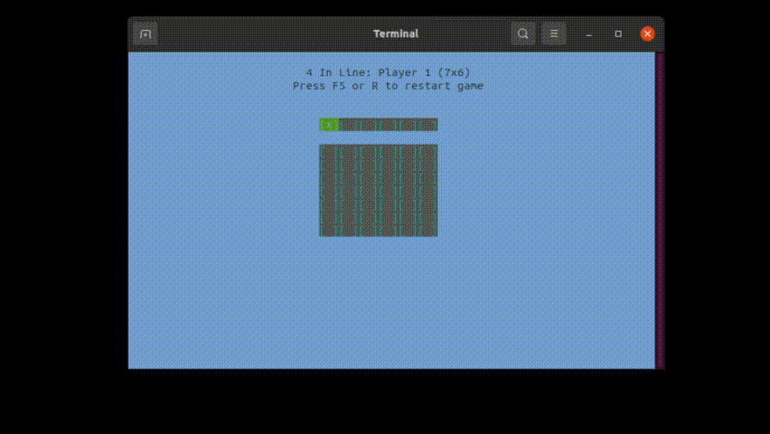
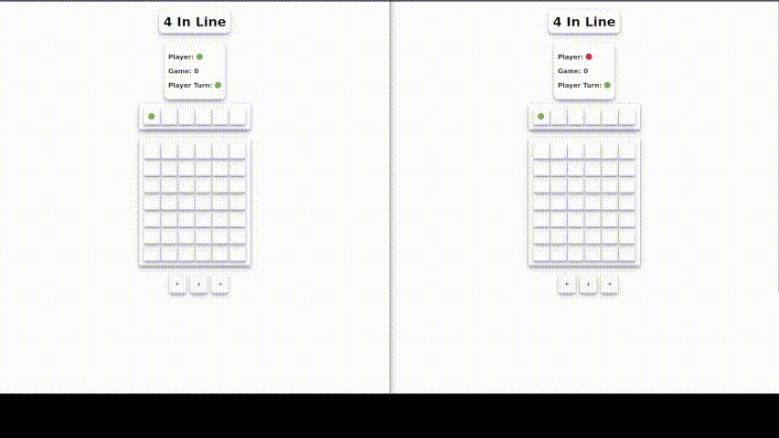

# Project 4 in line

## Made with [golang](https://go.dev)

# Instructions

## Docker usage

```bash
docker-compose up -d
```

## PC usage

- Install dependecies

```bash
go mod tidy
```

## There are two versions for 4 in line

## Console Version

```bash
make dev
```

without `make`

```bash
go run ${PWD}/cmd/console
```



## Web Version (websocket)

```bash
make start
```

without `make`

```bash
go run ${PWD}/cmd/server --port 6060 --client ${PWD}/client
```



